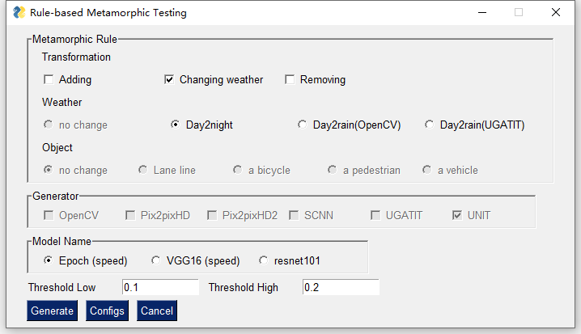
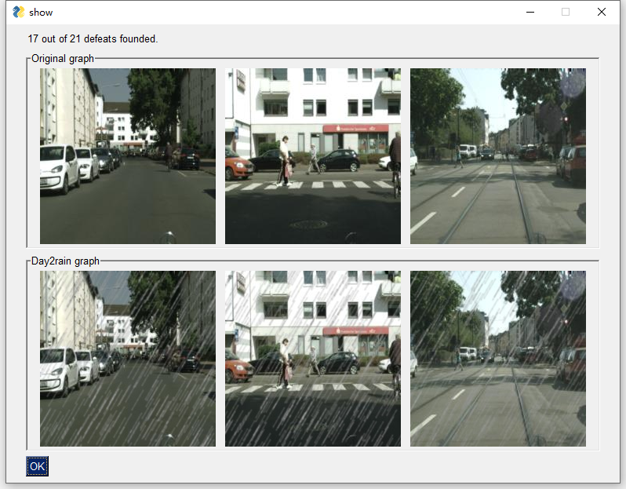
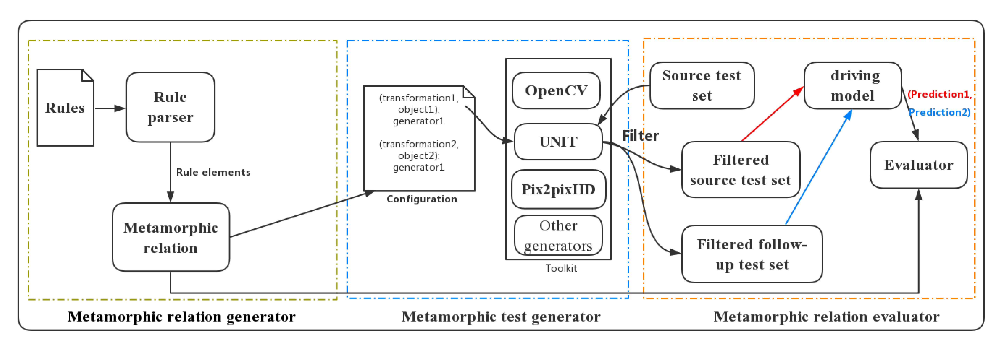

# Rule-based metamorphic testing

## Introduction

This repository is for the paper [Rule-based metamorphic testing for autonomous driving model]().

We propose a declarative, rule-based metamorphic testing approach called RMT. While existing techniques such as [DeepTest]() and [DeepRoad]() hardcode metamorphic relations (MRs), RMT enables domain experts to specify custom rules using a domain-specific language. RMT then translates each rule to a corresponding MR. It then injects meaningful input transformation entailed by the custom rule by leveraging pluggable input transformation engines. 

RMT currently incorporates four kinds of graphics and image transformation engines: 
1. object insertion based on semantic labels, 
2. affine transformations in Open CV, 
3. image-to-image translation based on GANs, and 
4. Spatial CNN based lane removal. 

Such pluggable transformation engines can be supplied by domain experts to express and test complex traffic rules, such as simultaneously changing the driving time to night time and injecting a pedestrian in front of a vehicle.

In this paper, we express the following six rules: 
1. Adding a vehicle in the front
2. Adding a bicycle in the front
3. Adding a pedestrian in the front
4. Changing to night time
5. Changing to rainy
6. Removing lane lines

Rules 1 - 5 are for testing speed prediction models. Rule 6 is to test steering angle prediction models. While Rules 1-5 are inequality metamorphic relations, Rule 6 is actually an equality metamorphic relation, created to check how partial disappearance of lanes affects steering angle prediction. 

In RMT, more diverse rules can be generated by combining existing rules to cover more complex real-world scenarios. For example, Rule 1 can be combined with Rule 5 to generate images that add a vehicle in front of the main vehicle on a rainy day. In Section 3, we combine Rules 1-3 with Rule 5 to generate three more rules (Rules 7-9) to evaluate the benefits brought by such composite rules:
7. Changing to rainy & Adding a vehicle in the front
8. Changing to rainy & Adding a bicycle in the front
9. Changing to rainy & Adding a pedestrian in the front

## Project architecture

> `train.py`: train driving models

> `mt_checker.py`: generate metamorphic test result

> `human_evaluation.py`: perform the human evaluation

> `rmt.xml`: the config of each rule

> **source_datasets**: folders for source images

> **follow_up_datasets**: folders for transformed images

> **models**: folders for checkpoints of driving models and generators

> **generators**: folders for image transformation generators

>> `rain.py`: implement transformations of ***Rule 5***

>>Pix2pixHD-master /`image_control.py`: implement transformations of ***Rule 1-3***

>>UNIT / `test_batch.py`: implement transformations of ***Rule 4***

>>UGATIT / `main.py`: implement transformations of ***Rule 5***

>>SCNN / `gen.py`: implement transformations of ***Rule 6***

> **UI**：Folder for Ui Files
>> `SimpleGUI.py`: The UI of RMT

## Prerequisites

+ Python version: 3.6
+ GPU : NVIDIA P100 12G memory (Requiring 12G memory or larger for Pix2pixHD)
+ Pytorch version: 1.1
+ Python libraries like OpenCV, PySimpleGUI, PIL, scipy==1.1.0, dominate.

## How to use RMT
This Toturial will show you how to constract a metamorphic testing using UMT for the Rule 5: changing to rainy.

At First, you need to download the `model_steer.zip` from google drive, and extract three models in it into the `./model` folder.
```https://drive.google.com/drive/u/1/folders/10xmtotVkSyFtwtCegmzscfQCabViJLbZ```

Then for the dataset, we provided a small set in RMT, and we will use it in this tutorial. If you want to use the full set, please refer to the section **dataset**.

To run RMT, you need to make sure that your have set up an enviroment same with the section **Prerequisites**.

Then you need to get into the `./UI` folder in the terminal
```python
cd ./UI
```

In the `./UI` folder run the following code. Currently, this GUI has been test on **Windows** and **Linux**. 
```python
python RMT_UI.py 
```



In this interface, in the Metamorphic Rule field, please select `changing weather` for Transformation and `Day2rain(OpenCV)` for Weather. Then please select `Epoch(speed)` for Model Name and click the `Generate` button. After few seconds, you can get the result of the metamorphic testing.



## Overview and usage of the framework



The framework takes a *rule* as the input. Based on the input, the framework would find the corresponding generator via `rmt.xml` that would be introduced later and call the generator to generate test sets. Then the framework will test driving models by test sets. We implemented the framework with a GUI.

The user could select rules defined in our paper, the threshold, and the model that needs to test. The framework could automatically select the correorganized sponding generator. Then the framework would generate test sets and the GUI would display a pair of sample images (source image and follow-up image). Finally, the GUI would show the test result.


Also, users could change the configs of default rules or add new rules by clicking the 'Config' button. The change of rules is saved in the `rmt.xml`. After clicking the button, 'Save new generator', the new rule will be saved, and it will be added on the main interface.


Furthermore, the Input_path and Output_path refers to the relative path of the input and output folder of each generator, for example `../source_datasets/original` and `../follow_up_datasets/night`. However, for Pix2Pix generators, because of the special requirement of its model, the Input_path refers the root of its input folder, for example `../source_datasets`. The Output_path of Pix2Pix is same with other generators, which is the output folder of itself, for example, `./follow_up_datasets/add_car`.
After transforming step, two folders will be generated in the Output_path to save the source image and generated image.


### RMT Configuration file

 `rmt.xml` is provided to binding generators and metamorphic rules , which is organized like following:

```xml
<config>
	<generator id="1">
		<model_name>Pix2pixHD2</model_name>
		<transformation>Adding</transformation>
		<object>a vehicle</object>
		<object_type>object</object_type>
		<location>In the front</location>
		<Pre_conditions>There is no coordinates conflict to add a vehicle</Pre_conditions>
		<model_path>../model</model_path>
		
		<input_path>../source_datasets</input_path>
		<output_path>../follow_up_datasets</output_path>
		<running_script>python ../generators/pix2pixHD-master/image_control.py --checkpoints_dir ../models --name label2city --add_object car --feature ../generators/pix2pixHD-master/car.npy</running_script>
	</generator>
</config>
```

Based on the configuration file, the framework could know how to run the generator by the configuration file. The `rmt.xml` of this project is at the root path.

### Pretrained models and datasets

The related dataset and pretrained models are saved in the Google Drive Folder:

```https://drive.google.com/drive/u/1/folders/10xmtotVkSyFtwtCegmzscfQCabViJLbZ```

## Dataset

+ In experiments we used Cityscape dataset that is originally used as image segmentation dataset. We choose this dataset because it provides semantic labels for images, which are used by Pix2pix GAN to generate driving scene images and adding objects on images. In the dataset, the training set (2975 frames) and validation set (500) frames have fine-grained semantic labels so we use them as the training set and testing set in our experiments. The dataset is used in two sub-tasks in our experiments.

  + Firstly, we use the dataset to train 3 autonomous driving E2E models with different CNN architectures for speed prediction. The inputs are driving scene images and the labels are speeds for each image provided in the dataset.
  + Secondly, we use the dataset to train Pix2pixHD GAN, which will be introduced in detail later.
+ We use a part of images from BDD100K dataset to train UNIT GAN for transforming day-time driving scene to night time. We manually random select day-time and night time images to construct the dataset. The detail training process of UNIT could be seen in the [official github](https://github.com/mingyuliutw/UNIT).

+ The cityscape  dataset could be downloaded from ```https://www.cityscapes-dataset.com/```. Then the dataset should be re-organized as [pix2pixHD official github](https://github.com/NVIDIA/pix2pixHD) introduces. Before you use the dataset for `UNIT`, `OpenCV` and `UGATIT`, please run the following code to change the image into 224\*224. Please put the source dataset and the formatted dataset in the same root folder. If you use this dataset for `Pix2pix`, you do nnot need to make changes on this dataset.

```python
python image_crop.py --input_path <> --output_path <>
```


## Autonomous driving E2E model training

In our experiments, we trained three different CNNs named Epoch (BaseCNN in code), VGG16, and Resnet101. Epoch is an architecture proposed in [Udacity Challenge 2](https://github.com/udacity/self-driving-car/blob/master/steering-models/community-models/cg23/epoch_model.py), we implemented the same architecture in Pytorch. VGG16 and Resnet101 are two classic transfer learning networks. We replaced their last classification layers with linear regression layers. The details could be seen in code `model.py`. 

The `Cityscapes` dataset could be downloaded from the official website. `leftImg8bit_trainvaltest.zip`, and `vehicle_trainvaltest.zip` should be downloaded, unzipped, and organized as the following architecture. `train` and `val` folders store driving images from `leftImg8bit_trainvaltest.zip`. `vehicle` folder contains files from  `vehicle_trainvaltest.zip`

.
To train a driving model, running the command

```python
python train.py --model_name <> --data_root <> 
```

`model_name` could be `epoch`, `vgg16`, or `resnet101`. `data_root` is the root path of your Cityscape dataset. Other optional parameters could be seen in code `train.py`.

## Pix2pixHD training

### Pix2pix training

Pix2pixHD is a GAN proposed by Nvidia for image-to-image translation. In our experiments, we added functions on it to manipulate instances (adding vehicles, bicycles, and pedestrians). The configuration detail could be seen on the [official repository](https://github.com/NVIDIA/pix2pixHD) 

To train Pix2pixHD,  the Cityscapes dataset should be put into `datasets/cityscapes` directory following the instruction in the official repository.  Then set the dataset path in file `base_option.py`. Finally, Opening the  terminal in the folder `generators/pix2pixHD-master`  and running the command:

```python
python train.py --name label2city_512p --instance_feat
```

When the training is finished, running

```python
python encode_features.py
```

to generate learned features for each class at the instance level.

## Human evaluation

We invited six people who have sufficient driving experiences to evaluate our testing result. We provided them the source test set and follow-up test set. They ranked the seasonality of the prediction change.  Images for human evaluation could be downloaded from [here](https://drive.google.com/open?id=1k7YURrxI4wJ2qETzy1GDagYR1FRjG-wW). And the link to the result of the human evaluation is [here](https://drive.google.com/open?id=1gVtA44abvsdjikQnvEVkoSJvh8tawyhC).
