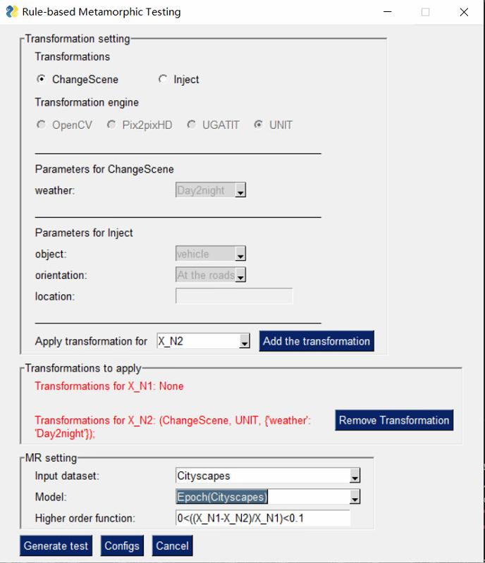

# Rule-based metamorphic testing

## Introduction

This repository is for the paper [Rule-based metamorphic testing for autonomous driving model]().

We propose a declarative, rule-based metamorphic testing framework called **RMT**. It is the first to expand automated testing capability for autonomous vehicles by enabling easy mapping of traffic regulations to executable metamorphic relations and to demonstrate the benefits of *expressivity*, *customization*, and *pluggability*.


It provides three components that work in concert: (1) a **domain-specific language** that enables an expert to express higher-order, compositional metamorphic relations, (2) **pluggable transformation engines** built on a variety of image and graphics processing techniques, and (3) **automated test generation** that translates a human-written rule to a corresponding executable, metamorphic relation and synthesizes meaningful inputs. 

 <!-- While existing techniques such as [DeepTest]() and [DeepRoad]() hardcode metamorphic relations (MRs), RMT enables domain experts to specify custom rules using a domain-specific language. RMT then translates each rule to a corresponding MR. It then injects meaningful input transformation entailed by the custom rule by leveraging pluggable input transformation engines.  -->

RMT currently incorporates three kinds of graphics and image transformation engines: 
1. object insertion based on semantic labels, 
2. affine transformations in Open CV, 
3. image-to-image translation based on GANs. 

Such pluggable transformation engines can be supplied by domain experts to express and test complex traffic rules, such as simultaneously changing the driving time to night time and injecting a pedestrian in front of a vehicle.

In this paper, we express 7 Simple Rules (SR): 
- **Rule 1**: Adding a vehicle *x* meters in front of the main vehicle should cause a deceleration to less than *t*
- **Rule 2**: Adding a speed limit sign at the roadside will cause a deceleration to less than *t*.
- **Rule 3-5**: Adding a vehicle/bicycle/pedestrian *x* meters in front of the main vehicle will cause a deceleration by *t<sub>1</sub>%* to *t<sub>2</sub>%*.
- **Rule 6-7**: Changing the driving scenes to night time or rainy day will cause a deceleration by *t<sub>1</sub>%* to *t<sub>2</sub>%*.

and 2 Composite Rules(CR):
- **Rule 8**: Adding a vehicle *x* meters in front of the main vehicle and changing to rainy day will cause a deceleration by *t<sub>1</sub>%* to *t<sub>2</sub>%*.
- **Rule 9**: Compared with adding a vehicle *x<sub>1</sub>* meters in front of the main vehicle, adding a vehicle *x<sub>2</sub>* meters (*x<sub>2</sub> < x<sub>1</sub>*) in front of the main vehicle will cause a bigger deceleration.

*For detailed introductions to each rules, please refer to the paper.*

<!-- *Rules 1* and *2*  are derived from traffic laws that give specific oracles (i.e., speed limits). Because they use a single transformation, *X<sub>N1</sub>* is always set to *X<sub>O</sub>*. *Rule 1* tests whether a driving model follows a safe driving distance regulation, when a vehicle appears in the front and close to the main vehicle. This is based on NSW Australia's traffic law (Figure XXX). To keep *3* seconds response time, there should be *50* meter distance from the front vehicle when the speed is above 60 km/h. Therefore, *M(X<sub>O</sub>)* should be no more than 60 km/h when a vehicle is located in the front less than 50 meters away from the main vehicle. *Rule 2* tests scenarios of seeing a speed limit sign. 

*Rules 3* to *7* are designed based on traffic rules that specify required driving behavior in certain circumstances without specific speed oracles. For example, Texas traffic law requires drivers to ''slow down and increase the following distance when the road is wet''. Since the speed oracle is not specified, we quantify the required driving behavior as the speed decrease ratio in a range. *Rules 3*, *4* and *5* test anomalous scenarios where objects suddenly appear in the front and close to the main vehicle, which is similar to *Rule 1* but allow the injection of more types of objects. *Rules 6* and *7* test the impact of different driving scenes on speed.

*Rules 8* and *9* are composite rules that compare the outcome of more than one transformation. Compared with the prior work that test relations between the original input and its modified input, **RMT** makes it easier to test the *compounding*, *proportional effect* of more than one transformation. -->


<!-- Rules 1 - 5 are for testing speed prediction models. Rule 6 is to test steering angle prediction models. While Rules 1-5 are inequality metamorphic relations, Rule 6 is actually an equality metamorphic relation, created to check how partial disappearance of lanes affects steering angle prediction. 

In RMT, more diverse rules can be generated by combining existing rules to cover more complex real-world scenarios. For example, Rule 1 can be combined with Rule 5 to generate images that add a vehicle in front of the main vehicle on a rainy day. In Section 3, we combine Rules 1-3 with Rule 5 to generate three more rules (Rules 7-9) to evaluate the benefits brought by such composite rules:
7. Changing to rainy & Adding a vehicle in the front
8. Changing to rainy & Adding a bicycle in the front
9. Changing to rainy & Adding a pedestrian in the front -->

## Project architecture

> `train_a2d2.py`, `train_cityscapes.py`: train driving models on two datasets

> `data_a2d2.py`, `data_cityscapes.py`: define dataloaders of two datasets

> `model_a2d2.py`, `model_cityscapes.py`: define models trained on two datasets

> `/models`: trained driving models and generators for image transformations 

> `/generators`: implementation of transformation engines

> `/test_images`: generated test image pairs 

> **UI**：Folder for Ui Files
>> `RMT_UI.py`: The UI of RMT

## Prerequisites

+ Python version: 3.6
+ GPU : NVIDIA P100 12G memory (Requiring 12G memory or larger for Pix2pixHD)
+ Pytorch version: 1.1
+ Python libraries like OpenCV, PySimpleGUI, PIL, scipy==1.1.0, dominate.

## How to use RMT
This Tutorial will show you how to construct metamorphic testing using UMT for Rule 6: Changing the driving scenes to night day will cause a deceleration by *t<sub>1</sub>%* to *t<sub>2</sub>%* on a small set of *cityscapes* dataset.

First, you need to download pretrained models and the dataset from [google drive](https://drive.google.com/drive/u/1/folders/10xmtotVkSyFtwtCegmzscfQCabViJLbZ) and extract `models` folder to replace the one in the project and extract `cityscapes_samples` folder to replace the one in the project.

To run RMT, you need to make sure that you have set up an environment same with the section **Prerequisites**.

Then you need to get into the `./UI` the folder in the terminal
```python
cd ./UI
```

In the `./UI` folder run the following code. Currently, this GUI has been tested on **Windows** and **Linux**. 
```python
python RMT_UI.py 
```



In this interface, in the Transformation setting field, please select `ChangeScene` for Transformation, `UNIT` for  and `Day2night` for Weather. Then please select `X_N2` to apply transformation and click 'Add the transformation'. Next, in Mrsetting field select `Cityscapes` for Input dataset, `Epoch(Cityscapes)` for Model, and `0<((X_N1-X_N2)/X_N1)<0.1` for Higher order function. Finally, please click the `Generate test` button. After a few seconds, you can get the result of the metamorphic testing.

<!-- ***这个地方要加一个对各个Rule的Higher order function*** -->


The following figure shows the result of rule 7 on A2D2 dataset. To test on A2D2, the full dataset is required. The detail introduction is in the dataset section. 

## Overview and usage of the framework


The framework takes a *rule* as the input. Based on the input, the framework would find the corresponding generator via `rmt.xml` that would be introduced later and call the generator to generate test sets. Then the framework will test driving models by test sets. We implemented the framework with a GUI.

The user could select rules defined in our paper, the threshold, and the model that needs to test. The framework could automatically select the correorganized sponding generator. Then the framework would generate test sets and the GUI would display a pair of sample images (source image and follow-up image). Finally, the GUI would show the test result.

For higher order function for each rule, we has few recommandation:
In this paper, we express 7 Simple Rules (SR): 
- **Rule 1**: M(X_N) < 60
- **Rule 2**: M(X_N) < 30
- **Rule 3**: 30 < (M(XN1) - M(XN2))=(M(XN1)) < 30
- **Rule 4**: 40 < (M(XN1) - M(XN2))=(M(XN1)) < 50
- **Rule 5**: 60 < (M(XN1) - M(XN2))=(M(XN1)) < 70
- **Rule 6**: 0 < (M(XN1) - M(XN2))=(M(XN1)) < 10
- **Rule 7**: 10 < (M(XN1) - M(XN2))=(M(XN1)) < 20
- **Rule 8**: 0 < (M(XN1) - M(XN2))=(M(XN1)) < 45
- **Rule 9**: (M(XN1) - M(XN2)) < 0


<!-- Also, users could change the configs of default rules or add new rules by clicking the 'Config' button. The change of rules is saved in the `rmt.xml`. After clicking the button, 'Save new generator', the new rule will be saved, and it will be added on the main interface. -->

## Configurations
RMT uses xml to configure transformation engines, driving models, and datasets. At the launch of RMT, the UI is automated created by parsing the xml file `/UI/rmt.xml`. Users could also easily change the configs of default transformation engines or add new transformations by modifying `UI/rmt.xml`, which is organized like following. In the future we will support using configuration button on UI to edit transformation engines. 

```xml
<config>
	<transformation id="4">
		<name>Inject</name>
		<engine>OpenCV</engine>
		<param name="object" type="fixed" check="1">vehicle</param>
		<param name="orientation" type="fixed" check="0">In the front</param>
		<param name="location" type="input" check="1">50</param>   
		<running_script>python ../generators/Opencv/add.py </running_script>
	</transformation>
</OTC>
</MUT>
</config>
```

\<Transformation> defines a transformation where users could set up its name, transformation engine name, parameters, and running scripts. For parameters, attribute *fixed*  is used to make RMT create combo box or input box in UI and attribute *check* is used to add the parameter in the running script.


<!-- ### RMT Configuration file

 `rmt.xml` is provided to binding generators and metamorphic rules , which is organized like following:

```xml
<config>
	<generator id="1">
		<model_name>Pix2pixHD2</model_name>
		<transformation>Adding</transformation>
		<object>a vehicle</object>
		<object_type>object</object_type>
		<location>In the front</location>
		<Pre_conditions>There is no coordinates conflict to add a vehicle</Pre_conditions>
		<model_path>../model</model_path>
		
		<input_path>../source_datasets</input_path>
		<output_path>../follow_up_datasets</output_path>
		<running_script>python ../generators/pix2pixHD-master/image_control.py --checkpoints_dir ../models --name label2city --add_object car --feature ../generators/pix2pixHD-master/car.npy</running_script>
	</generator>
</config>
```

Based on the configuration file, the framework could know how to run the generator by the configuration file. The `rmt.xml` of this project is at the root path. -->

### Pretrained models and datasets

The related dataset and pretrained models are saved in the [Google Drive](https://drive.google.com/drive/u/1/folders/10xmtotVkSyFtwtCegmzscfQCabViJLbZ). Please unzip `models` and `cityscapes_samples` to replace the folders in the project. 


## Dataset

In experiments we used *A2D2* dataset, which is published by Audi and contains images extracted from driving videos. The dataset could be donwloaded form its [official website](https://www.a2d2.audi/a2d2/en/download.html). Please download the dataset for semantic segmentation. In the project we use images in `20181108_091945` folder as the test set. To use RMT on A2D2, please configure the location of the folder in `UI/rmt.xml`.

We also use *Cityscapes* dataset. The cityscape dataset could be downloaded from the [official website](https://www.cityscapes-dataset.com/). We provide a small set of the dataset `cityscapes_samples` that can be downloaded from the [Google Drive](https://drive.google.com/drive/u/1/folders/10xmtotVkSyFtwtCegmzscfQCabViJLbZ).  

<!-- Then the dataset should be re-organized as [pix2pixHD official github](https://github.com/NVIDIA/pix2pixHD) introduces. Before you use the dataset for `UNIT`, `OpenCV` and `UGATIT`, please run the following code to change the image into 224\*224. Please put the source dataset and the formatted dataset in the same root folder. If you use this dataset for `Pix2pix`, you do not need to make changes on this dataset.

```python
python image_crop.py --input_path <> --output_path <>
``` -->

We also use a part of images from BDD100K dataset to train UNIT GAN for transforming day-time driving scenes to night time. We manually random select day-time and night time images to construct the dataset. The detailed training process of UNIT could be seen in the [official github](https://github.com/mingyuliutw/UNIT).

<!-- ## Autonomous driving E2E model training

In our experiments, we trained three different CNNs named Epoch (BaseCNN in code), VGG16, and Resnet101. Epoch is an architecture proposed in [Udacity Challenge 2](https://github.com/udacity/self-driving-car/blob/master/steering-models/community-models/cg23/epoch_model.py), we implemented the same architecture in Pytorch. VGG16 and Resnet101 are two classic transfer learning networks. We replaced their last classification layers with linear regression layers. The details could be seen in the file `model.py`. 


.
To train a driving model, running the command

```python
python train.py --model_name <> --data_root <> 
```

`model_name` could be `epoch`, `vgg16`, or `resnet101`. `data_root` is the root path of your Cityscape dataset. Other optional parameters could be seen in the file `train.py`.

## Pix2pixHD training

### Pix2pix training

Pix2pixHD is a GAN proposed by Nvidia for image-to-image translation. In our experiments, we added functions on it to manipulate instances (adding vehicles, bicycles, and pedestrians). The configuration detail could be seen on the [official repository](https://github.com/NVIDIA/pix2pixHD) 

To train Pix2pixHD,  the Cityscapes dataset should be put into `datasets/cityscapes` directory following the instruction in the official repository.  Then set the dataset path in file `base_option.py`. Finally, Opening the  terminal in the folder `generators/pix2pixHD-master`  and running the command:

```python
python train.py --name label2city_512p --instance_feat
```

When the training is finished, running

```python
python encode_features.py
```

to generate learned features for each class at the instance level. -->

## Human evaluation

We invited six people who have sufficient driving experiences to evaluate our testing results. We provided them the source test set and follow-up test set. They ranked the seasonality of the prediction change.  Images for human evaluation could be downloaded from [here](https://drive.google.com/open?id=1k7YURrxI4wJ2qETzy1GDagYR1FRjG-wW).
